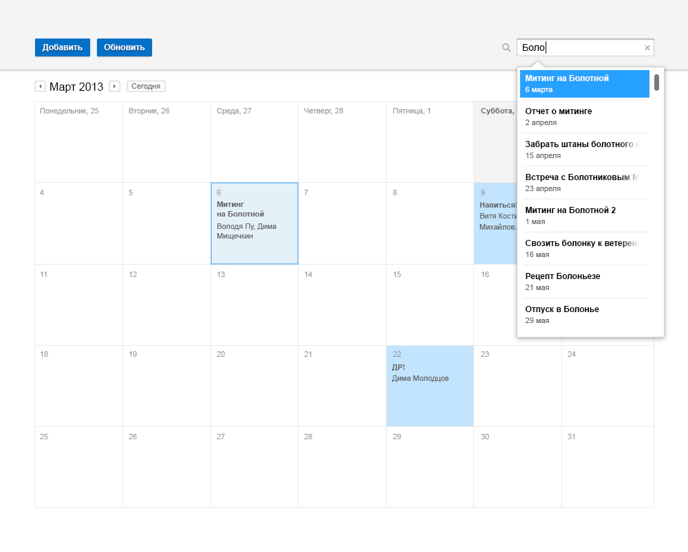

Тестовое задание для разработчика frontend
==========================================

Сверстать страницу календаря в соответствии с макетом ниже.    
В случае использования сторонних библиотек(JS/CSS) укажите их в письме.

Разместите результат на GitHub и пришлите нам ссылку.

Плюсом будет реализация дополнительной JS-логики(работы календаря):
 * добавление/редактирование событий;
 * переход по месяцам;
 * поиск;аываываываываы
 * сохранение календаря в localStorage.

### Примеры дополнительной логики работы

Добавление события

Быстрое добавление события

Просмотр события + редактирование описания

Поиск:

Тестовое задание для разработчика backend
==========================================

Сверстать страницу календаря(соответствие с макетом не обязательно).    
В случае использования сторонних библиотек(JS/CSS) укажите их в письме.

Разместите результат на GitHub и пришлите нам ссылку.

#Требования к заданию

 * Храдение всех данных календаря либо в sqlite либо в mysql. NoSQL не нужно;
 * добавление/редактирование событий, переход по месяцам, поиск реализовать через ajax;

Если есть какие то непонятные моменты, не стесняйтесь задавать вопросы по адресу: shishkinb13@gmail.com